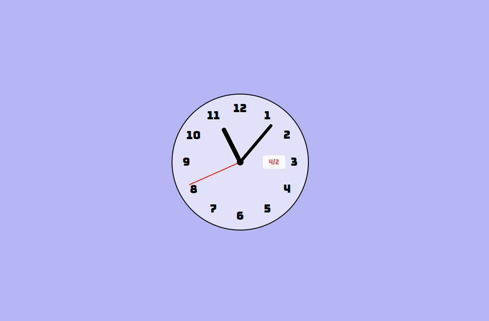

## A Clock with JavaScript
___
Little educational project following some instructions from [YouTube](https://www.youtube.com/watch?v=Ki0XXrlKlHY&t=908s) with some additional perks as a date window, proper alignment of numbers without rotation, and a different font from [Google Fonts](https://fonts.google.com/specimen/Pacifico?preview.text=123456789&preview.text_type=custom)
In this project, we didn't use any vector images for clock hands or display.

### Clock view

___
This project was created only for educational purposes
